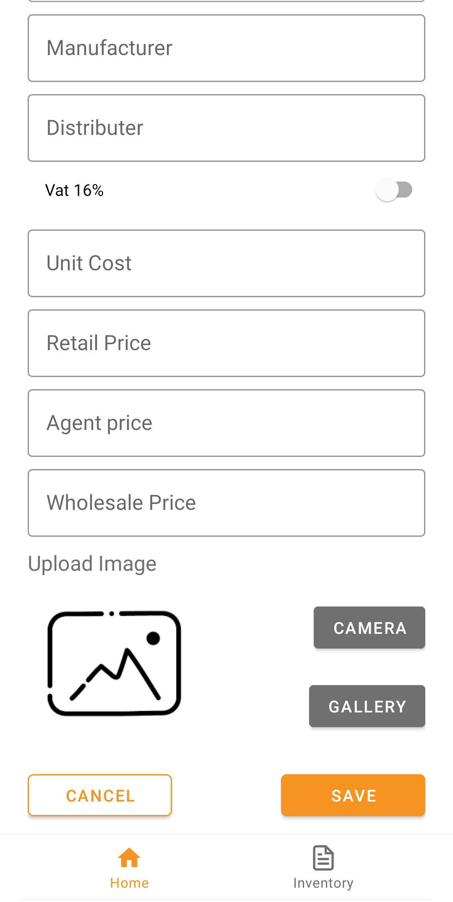
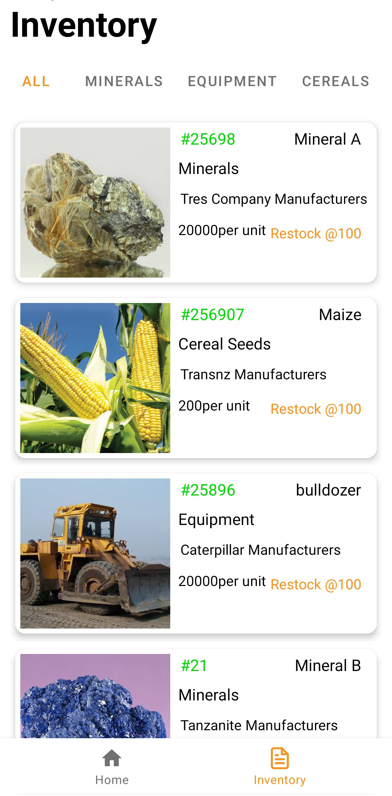
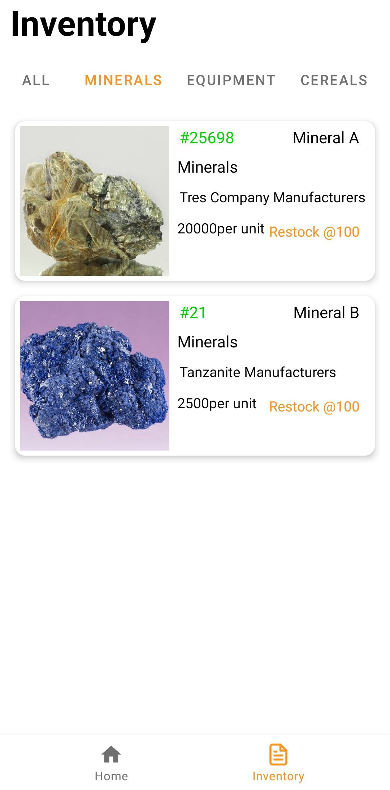
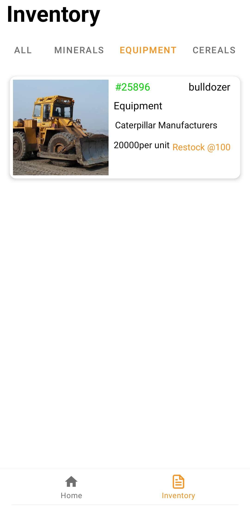
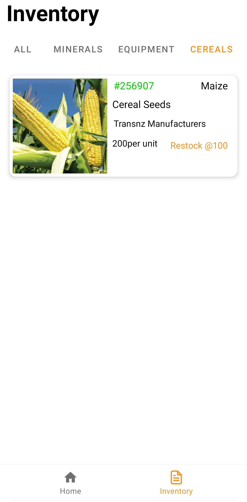
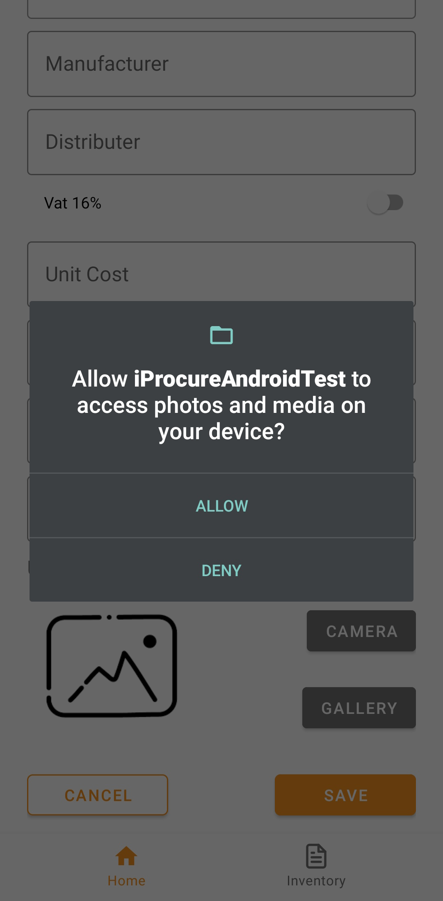

# iProcureAndroidTest

This is an application to enable a user to manage a product listing (in an e-commerce environment). 📝. Written in Kotlin and implements android libraries. Currently all changes are stored in the Room database. 

## Functionality
- Create a product( refer to screen below). 
- View a list of products created. 
- Filter list of products per category and search. 
- The android application should be able to work offline 

## Libraries used

- Room
- Viewmodel
- Livedata
- Coroutines
- Material library
- Navigation Components

  
  ## Screenshots

 
 

 
 

## WIP
-  [ ] Tests (both UI and Unit)
